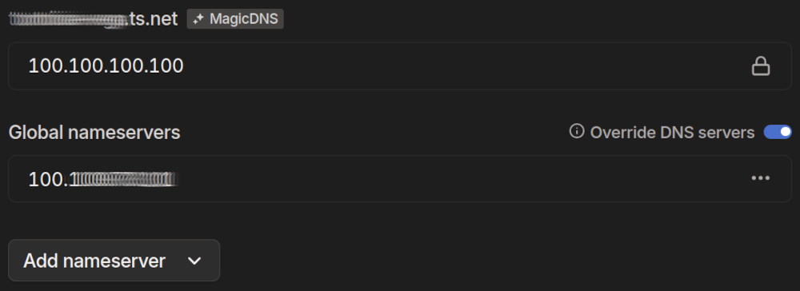

## Problem statement

I needed a setup where the same domain name (e.g. test.example.com) would resolve correctly both at home and when connected to the Tailscale VPN.

Using Tailscale exclusively, even in local network, is possible but not ideal. It introduces unnecessary complexity and depends on external connectivity. A better approach is to configure DNS so that:

- On the local network, the domain resolves to a private IP (e.g. 192.168.x.x).
- Over the Tailscale VPN, it resolves to the Tailscale IP (e.g. 100.x.x.x).

That's where [Split DNS](https://en.wikipedia.org/wiki/Split-horizon_DNS) comes in.

## Limitations of Tailscale Split DNS

I considered using [NextDNS](https://nextdns.io) with its record rewrite functionality to conditionally resolve custom domain queries when connected to the VPN. There wouldn't be many queries, so the NextDNS free tier would suffice. On the local network, I planned to add DNS records to my home router.

This could work, but Tailscale's Split DNS feature only allows redirecting queries for custom domains to specific IP addresses. NextDNS can only be configured as a global DNS nameserver, which I wanted to avoid because I didn't want it handling all my DNS queries.

As a result, I opted for a self-hosted DNS server: [Pi-hole](https://pi-hole.net).

## Using Pi-hole

To keep the setup simple, I deployed a single Pi-hole instance rather than separate instances for the local and Tailscale networks.

Pi-hole uses [dnsmasq](https://thekelleys.org.uk/dnsmasq/docs/dnsmasq-man.html), which can return different DNS answers depending on the source interface. Configuration involves enabling _localise-queries_ and defining multiple _host-record_ entries:

```text title="dnsmasq.d/99-host-records.conf.j2"
localise-queries
host-record=test.example.com,172.x.x.x
host-record=test.example.com,192.168.x.x
```

This approach doesn't allow explicit control over which IP is returned. For example, the host record needs to be from the same network as the source interface.

Alternative configurations, such as conditional forwarding (using _rev-server_) or binding separate dnsmasq instances to different network interfaces, are possible but more complex and likely not well supported by Pi-hole.

## Pi-hole in Docker

Running Pi-hole in Docker introduces an issue with source IP detection when using a bridge network. All DNS queries appear to come from the same internal Docker subnet, which breaks source-based resolution.

To resolve this, Pi-hole must run in host network mode. This allows it to receive queries directly from the actual network interfaces.

An alternative approach could be to use the Docker Macvlan network driver, but I haven't tested that.

## Pi-hole in Tailscale

Pi-hole needs to be set up as a global nameserver with DNS server override enabled. This ensures that Tailscale clients use that nameserver to resolve names both inside and outside the tailnet.



## DNS Resolution Behavior

The resulting DNS resolution behavior is:

- Local network -> 192.168.x.x
- Local with Tailscale -> 192.168.x.x
- Remote with Tailscale -> 100.x.x.x

You can find the full configuration in my [homelab](https://github.com/ganczarek/homelab) GitHub repo.
